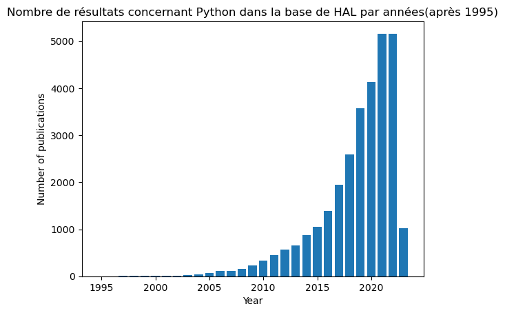

Par POPINEAU Maxime (rapport réalisé en stage de Master 2 coencadré par Marie-Laure Massot, Emilien Schultz et Agnès Tricoche, dans le cadre de l'initiative Digit_Hum, d'avril-juillet 2023).[^1]

## <span style="font-size: 14pt"> Information sur les données.</span>

Les données utilisées dans ce notebook proviennent du site HAL (https://hal.science/). L’archive ouverte pluridisciplinaire HAL est destinée au dépôt et à la diffusion en libre accès des travaux scientifiques des chercheurs, émanant des établissements d'enseignement et de recherche français ou étrangers, des laboratoires publics ou privés. Son interface en ligne permet de partager librement les savoirs. Il est également possible d’interagir avec la base de données de HAL via une API*, et notamment de l’interroger pour y effectuer des recherches selon divers critères puis de récupérer les résultats dans différents formats de données structurées.

Une API (Interface de programmation d'application) fournit des "endpoints" permettant d'interagir avec leur site web afin de récupérer des informations grâce à des recherches. Les APIs facilitent la communautation entre plusieurs applications informatiques : cela sert à ce que les applications puissent échanger des informations entre-elles. Le but est pour les développeurs de créer des applications qui permettent d'utiliser plusieurs APIS en même temps.


L'utilisation d'une API nécessite également une chaîne de requête ("query string" en anglais), qui est une partie à ajouter à droite de l'URL de base pour inclure des paramètres et des valeurs.

Un exemple de chaîne de requête est : https://api.archives-ouvertes.fr/search/?q=%22jupyter%20notebook%22. Cette URL fonctionne directement dans notre navigateur web et renvoie les résultats de notre recherche.

https://api.archives-ouvertes.fr/search est la première partie qui permet de rechercher dans l'API des archives ouvertes. La deuxième partie, ?q=%22jupyter%20notebook%22, permet de spécifier notre requête, qui est "jupyter notebook".

Certains caractères, tels que l'espace ou les guillemets doubles, doivent être transmis correctement via le protocole HTTP pour être encodés. Le %22 correspond à l'encodage ASCII du caractère double guillemet et le %20 correspond à l'encodage de l'espace. Cela permet à l'ordinateur d'effectuer la requête sur "jupyter notebook" et non  "jupyter" et "notebook" séparément.

L'utilisation d'une API permet d'interroger les données en utilisant des paramètres, par exemple pour connaître le nombre d'articles publiés dans HAL en 2014.

Dans ce notebook, nous allons voir comment utiliser l'API HAL ainsi que les bibliothèques pandas et matplotlib. 

:::{attention}Compétences requises en Python.
Ce Jupyter Notebook nécessite d'avoir des compétences en Python pour le réaliser. Il existe néanmoins une manière pour les non programmeurs d'interagir avec l'API de HAL ci-dessous :

:::

:::{note}Pour les personnes qui ne connaissent pas Python.
Les IpyWidgets permettent à des utilisateurs qui ne savent pas coder d'utiliser l'API des HAL avec des paramètres comme le type de documents ou les années.
:::


## <span style="font-size: 14pt"> Objectifs de ce Jupyter Notebook.</span>

Ce Jupyter Notebook vise à  :

1. Faire un panorama des pratiques numériques des chercheurs.
2. Fournir un exemple de Jupyter Notebook reproductible et de qualité. 
3. Enseigner des compétences aux utilisateurs débutants ou expérimentés avec Python.

## <span style="font-size: 14pt"> Compétences requises.</span>

Ce Jupyter Notebook est à destination d'un public débutant. Il est préférable de connaître le langage informatique Python pour suivre le Notebook, mais cela n'est pas obligatoire.

Le document permet d'acquérir des compétences variées comme :

1. Savoir utiliser les différentes librairies comme pandas et matplotlib.
2. Utiliser les fonctions en Python pour éviter la duplication du code.
3. Savoir faire une requête dans une API.


## Section 0 : Importation des librairies.

Dans cette section, nous allons importer les librairies nécessaires à notre analyse.

:::{important}Le rôle des libraries

La librairie requests et json permet de faire les requêtes dans l'API de HAL.

Pandas est utilisé pour faire de l'analyse de données. La librairie fournit des fonctions pour créer, manipuler et analyser les DataFrames (les tableaux).

Matplotlib permet de faire des graphiques et de visualiser les données.

:::


```python
import requests, json
import pandas as pd
import matplotlib.pyplot as plt
```

## Section 1 : Analyse du nombre de publications citant Python et les Jupyter Notebooks.

Nous pouvons faire une analyse stastique du nombre de publications dans la base de données HAL et comparer avec l'utilisation de Python et des Jupyter Notebooks.

## <span style="font-size: 12pt">1.0 : Utilisation d'une fonction qui retourne le nombre d'articles par année en fonction d'une recherche.</span>


:::{tip}Bonne pratique

Les fonctions permettent de rendre le code plus lisible et d'en réduire sa duplication. Elles font parties des bonnes pratiques à adopter dans un notebook.

:::


Pour faire une requête dans l'API, il est nécessaire de lire la documentation du site HAL disponible à cette adresse : https://api.archives-ouvertes.fr/docs/search


```python
def get_publication_counts(query):
    # Effectue une requête pour obtenir le nombre total de publications
    req = requests.get(f"https://api.archives-ouvertes.fr/search/?q=text_fulltext:({query})&rows=0&facet=true&facet.field=publicationDateY_i")
    req_json = req.json()
    nb = req_json["response"]["numFound"]
    print(f"Le nombre total de résultats est de : {nb}\n")

    # Effectue une requête pour obtenir le nombre de publications par année
    year_counts = []
    for year in range(1995, 2023):
        req = requests.get(f"https://api.archives-ouvertes.fr/search/?q=text_fulltext:({query}) AND publicationDateY_i:{year}&rows=0")
        req_json = req.json()
        year_count = req_json["response"]["numFound"]
        year_counts.append((year, year_count))

    # Transforme la liste de tuples en un DataFrame pandas et le renvoie
    df = pd.DataFrame(year_counts, columns=["Année", "Nombre de publications"])
    return df
```

Nous allons ensuite appelet cette fonction et imprimer le dataframe créé grâce à la librairie Pandas.


```python
df = get_publication_counts("python")
print(df)
```

    Le nombre total de résultats est de : 29737
    
        Année  Nombre de publications
    0    1995                       2
    1    1996                       1
    2    1997                       3
    3    1998                       4
    4    1999                       7
    5    2000                       8
    6    2001                      10
    7    2002                      13
    8    2003                      32
    9    2004                      32
    10   2005                      68
    11   2006                     114
    12   2007                     108
    13   2008                     161
    14   2009                     224
    15   2010                     328
    16   2011                     444
    17   2012                     566
    18   2013                     660
    19   2014                     877
    20   2015                    1048
    21   2016                    1386
    22   2017                    1930
    23   2018                    2606
    24   2019                    3577
    25   2020                    4154
    26   2021                    5148
    27   2022                    5169
    

Le dataframe montre une augmentation importante des articles concernant Python dans la base de donnée HAL. Le nombre d'articles sur Python passe de 10 en 2001 à 444 en 2011 puis 5143 en 2021 soit une multiplication par 500 en l'espace d'une vingtaine d'années. Il est important de noter que l'année 2022 est la première année de baisse du nombre d'articles concernant Python par rapport à l'année précédente depuis 1996.

## <span style="font-size: 12pt">1.1 : Faire un graphique avec la librairie Matplotlib pour voir le nombre de publications sur Python en fonction des années.</span>

Nous allons passer maintenant à la représentation graphique avec la librairie Matplotlib.


```python
# Effectue une requête pour obtenir le nombre d'articles avec le mot-clé "Python"
query = "python"
req = requests.get(f"https://api.archives-ouvertes.fr/search/?q=text_fulltext:({query})&rows=0&facet=true&facet.field=producedDateY_i")
req_json = req.json()
nb = req_json["response"]["numFound"]
print(f"Le nombre d'articles contenant le mot clé '{query}' est de : {nb}\n")

# Effectue uen requête pour obtenir le nombre d'articles avec le mot-clé "Python" par année
year_counts = req_json["facet_counts"]["facet_fields"]["producedDateY_i"]
year_counts = [year_counts[i:i+2] for i in range(0, len(year_counts), 2) if int(year_counts[i]) >= 1995]
years = [int(year) for year, count in year_counts]
counts = [count for year, count in year_counts]

# Création du graphique
plt.bar(years, counts)
plt.title("Nombre de résultats concernant Python dans la base de HAL par années(après 1995)")
plt.xlabel("Year")
plt.ylabel("Number of publications")
plt.show()
```

    Le nombre d'articles contenant le mot clé 'python' est de : 29737
    
    


    

    

:::{note}
Matplotlib nous permet de visualiser l'augmentation du nombre des articles sur Python ces 25 dernières années dans HAL. Nous constatons que l'année 2023 marquera peut être une baisse du nombre d'articles publiés sur Python car cinq mois se sont déjà écoulés et il y a à peine 1000 articles dans la base de données.
:::

L'année 2023 marquera probablement une baisse dans le nombre d'articles publiés sur Python dans la base de données de HAL car 5 mois se sont déjà écoulés et il n'y a même pas 1000 articles.

## <span style="font-size: 12pt"> 1.2 : Obtenir les résultats pour les Jupyter Notebooks.</span>

Nous appelons la même fonction que dans le 1.0


```python
df = get_publication_counts("jupyter AND (notebook OR notebooks)")
print(df)
```

    Le nombre total de résultats est de : 845
    
        Année  Nombre de publications
    0    1995                       0
    1    1996                       0
    2    1997                       0
    3    1998                       0
    4    1999                       0
    5    2000                       0
    6    2001                       0
    7    2002                       0
    8    2003                       0
    9    2004                       0
    10   2005                       0
    11   2006                       0
    12   2007                       0
    13   2008                       0
    14   2009                       0
    15   2010                       0
    16   2011                       0
    17   2012                       0
    18   2013                       0
    19   2014                       0
    20   2015                       1
    21   2016                      12
    22   2017                      24
    23   2018                      69
    24   2019                     107
    25   2020                     138
    26   2021                     213
    27   2022                     224
    

Le Dataframe montre une augmentation importante des articles mentionnant les Jupyter Notebooks (avec et sans "s") dans la base de donnée HAL. Ils passent en effet de 12 en 2016 à 70 (multiplé par 5) en 2018 puis à 223 en 2022. Ainsi, le nombre de publications déposées dans HAL citant les Jupyter Notebooks a été multiplé à peu près par 19 entre 2016 et 2022.

Il est néanmoinq important de comparer cette hausse d'intérêt pour Python et pour les Jupyter Notebooks à la hausse du nombre d'articles dans HAL. En effet, cette hausse du nombre d'articles pourrait ne pas être la conséquence d'une hausse d'intérêt mais d'une simple hausse dans le nombre d'articles déposés dans l'archive ouverte.

## <span style="font-size: 12pt"> 1.3 : Calculer le pourcentage d'articles mentionnant Python et les Jupyter Notebooks par rapport au nombre total d'articles publiés dans HAL au cours du temps.</span>

Nous utilisons l'API de HAL et la librairie pandas pour créer un tableau.


```python
# Récupère le nombre total d'articles pour chaque année
total_counts = []
for year in range(1995, 2023):
    req = requests.get(f"https://api.archives-ouvertes.fr/search/?q=*&fq=producedDateY_i:{year}&rows=0")
    req_json = req.json()
    year_count = req_json["response"]["numFound"]
    total_counts.append((year, year_count))
total_df = pd.DataFrame(total_counts, columns=["year", "total_articles"])

# Récupère le nombre d'articles concernant Python pour chaque année
python_counts = []
for year in range(1995, 2023):
    req = requests.get(f"https://api.archives-ouvertes.fr/search/?q=text_fulltext:(Python)&fq=producedDateY_i:{year}&rows=0")
    req_json = req.json()
    year_count = req_json.get("response", {}).get("numFound", 0)
    python_counts.append((year, year_count))
python_df = pd.DataFrame(python_counts, columns=["year", "python_articles"])

# le nombre d'articles concernant les Jupyter Notebooks pour chaque année
jupyter_counts = []
for year in range(1995, 2023):
    req = requests.get(f"https://api.archives-ouvertes.fr/search/?q=text_fulltext:(jupyter AND (notebook OR notebooks))&fq=producedDateY_i:{year}&rows=0")
    req_json = req.json()
    year_count = req_json.get("response", {}).get("numFound", 0)
    jupyter_counts.append((year, year_count))
jupyter_df = pd.DataFrame(jupyter_counts, columns=["year", "jupyter_articles"])

# Fusionne les trois dataframes
merged_df = pd.merge(total_df, python_df, on="year")
merged_df = pd.merge(merged_df, jupyter_df, on="year")

# Calcul le pourcentage des articles concernant Python et les JupyterNotebooks pour chaque année.
merged_df["percent_python"] = merged_df["python_articles"] / merged_df["total_articles"] * 100
merged_df["percent_jupyter"] = merged_df["jupyter_articles"] / merged_df["total_articles"] * 100

# Visualise le tableau
print(merged_df)
```

        year  total_articles  python_articles  jupyter_articles  percent_python  \
    0   1995           22489                2                 0        0.008893   
    1   1996           24106                1                 0        0.004148   
    2   1997           25854                4                 0        0.015471   
    3   1998           27630                4                 0        0.014477   
    4   1999           28524                6                 0        0.021035   
    5   2000           32962                8                 0        0.024270   
    6   2001           34906               10                 0        0.028648   
    7   2002           42052               13                 0        0.030914   
    8   2003           51433               31                 0        0.060273   
    9   2004           62754               34                 0        0.054180   
    10  2005           83609               67                 0        0.080135   
    11  2006           99794              114                 0        0.114235   
    12  2007          109924              109                 0        0.099159   
    13  2008          115399              160                 0        0.138649   
    14  2009          124946              227                 0        0.181678   
    15  2010          137047              332                 0        0.242253   
    16  2011          142782              447                 0        0.313065   
    17  2012          149234              564                 0        0.377930   
    18  2013          158251              662                 0        0.418323   
    19  2014          164624              874                 0        0.530907   
    20  2015          175373             1055                 1        0.601575   
    21  2016          186786             1390                13        0.744167   
    22  2017          194924             1940                23        0.995260   
    23  2018          198273             2596                68        1.309306   
    24  2019          199952             3580               108        1.790430   
    25  2020          172297             4138               138        2.401667   
    26  2021          180873             5157               212        2.851172   
    27  2022          156396             5162               221        3.300596   
    
        percent_jupyter  
    0          0.000000  
    1          0.000000  
    2          0.000000  
    3          0.000000  
    4          0.000000  
    5          0.000000  
    6          0.000000  
    7          0.000000  
    8          0.000000  
    9          0.000000  
    10         0.000000  
    11         0.000000  
    12         0.000000  
    13         0.000000  
    14         0.000000  
    15         0.000000  
    16         0.000000  
    17         0.000000  
    18         0.000000  
    19         0.000000  
    20         0.000570  
    21         0.006960  
    22         0.011799  
    23         0.034296  
    24         0.054013  
    25         0.080094  
    26         0.117209  
    27         0.141308  
    

Le tableau montre que le pourcentage des documents mentionnant Python et les Jupyter Notebooks augmente au fil des années dans le total de documents publiés dans HAL. L'intérêt pour ce langage de programmation et ce type de carnets interactifs semble donc augmenter sensiblement dans le cadre de la recherche.

 En effet, si en 2002, les documents relatifs à Python ne représentaient que 0,03% du total des documents présents dans HAL, ce chiffre est passé à 0,37% en 2012 et a atteint 3,31% en 2022. Notons aussi, que le projet Jupyter a été lancé en 2014 et que les premiers résultats apparaissent en 2015 avec un document traitant des Jupyter Notebooks. En 2019, le pourcentage des documents relatifs aux Jupyter Notebooks représentaient 0,05% du nombre total de documents présents dans HAL. Ce chiffre est de 0,14% en 2022. Bien que l'intérêt pour Python et les Jupyter Notebooks soit en hausse, le nombre d'articles les concernant reste relativement faible dans la base de données de HAL.

## Section 2 : Travail d'analyse sur la recherche "Python" et "Jupyter Notebook".

Cette section permet d'apprendre à faire une requête multicritères dans l'API de HAL pour obtenir un type particulier de documents (articles, communication ou autres) au sein d'une recherche précise (dans notre exemple, la recherche des mots clés "Python" ou Jupyter Notebook(s)). Nous verrons aussi comment récupérer dans l'API de HAL le domaine de recherche pour identifier les disciplines qui intègrent le plus les Jupyter Notebooks dans leur pratique de recherche ou d'enseignement. Notre hypothèse étant bien sûr que ces outils sont plus présents en informatique et dans les disciplines scientifiques qu'en Sciences humaines et sociales. Cela nous permettra d'affiner l'analyse des résulats obtenus dans les sections précédentes.

## <span style="font-size: 12pt"> 2.0 : Obtenir le type de document en fonction d'une recherche.</span>

Pour faire une requête dans l'API, il est nécessaire de lire la documentation du site HAL disponible à cette adresse : https://api.archives-ouvertes.fr/docs/search


```python
def get_doc_types(query):
    req = requests.get(f"https://api.archives-ouvertes.fr/search/?q={query}&rows=0&facet=true&facet.field=docType_s")
    req_json = req.json()
    doc_types = req_json["facet_counts"]["facet_fields"]["docType_s"]
    doc_types = [doc_types[i:i+2] for i in range(0, len(doc_types), 2)]
    total_docs = req_json["response"]["numFound"]
    doc_types_dict = {doc_type: count/total_docs*100 for doc_type, count in doc_types}
    return doc_types_dict
```

Nous faisons une fonction que nous allons appeler dans la suite de notre code comme dans la Section 1.


```python
doc_types = get_doc_types("text_fulltext:(python)")
print(doc_types)
```

    {'ART': 47.17355483068231, 'COMM': 25.587651746981876, 'THESE': 11.974980663819485, 'UNDEFINED': 5.346874264384437, 'REPORT': 2.649897434172916, 'MEM': 2.2564481958502873, 'COUV': 1.4863637892188184, 'POSTER': 0.8339778726838618, 'HDR': 0.6860140565625316, 'OTHER': 0.5481386824494737, 'OUV': 0.41362612233917345, 'LECTURE': 0.32283014426472073, 'PROCEEDINGS': 0.211857282173723, 'SOFTWARE': 0.1715035141406329, 'BLOG': 0.11433567609375525, 'PRESCONF': 0.09079597807445271, 'ISSUE': 0.030265326024817567, 'VIDEO': 0.023539698019302554, 'OTHERREPORT': 0.016814070013787537, 'REPORT_FORM': 0.013451256011030031, 'REPORT_LICE': 0.013451256011030031, 'REPORT_LABO': 0.010088442008272523, 'ETABTHESE': 0.0033628140027575078, 'MAP': 0.0033628140027575078, 'MEMLIC': 0.0033628140027575078, 'REPORT_LPRO': 0.0033628140027575078, 'REPORT_MAST': 0.0033628140027575078, 'SYNTHESE': 0.0033628140027575078, 'TRAD': 0.0033628140027575078, 'CREPORT': 0.0, 'DOUV': 0.0, 'IMG': 0.0, 'MANUAL': 0.0, 'NOTE': 0.0, 'NOTICE': 0.0, 'PATENT': 0.0, 'REPACT': 0.0, 'REPORT_COOR': 0.0, 'REPORT_DOCT': 0.0, 'REPORT_ETAB': 0.0, 'REPORT_FPROJ': 0.0, 'REPORT_GLICE': 0.0, 'REPORT_GMAST': 0.0, 'REPORT_RETABINT': 0.0, 'REPORT_RFOINT': 0.0, 'SON': 0.0}
    

Nous contastons que parmi les documents liés à Python dans la base de données HAL, les articles scientifiques représentent 47%, suivis des communications à 25%, et des thèses à 11%. En revanche, les cours ne représentent qu'une faible proportion de 0,32%.


```python
doc_types = get_doc_types("jupyter AND (notebook OR notebooks)")
print(doc_types)
```

    {'ART': 39.130434782608695, 'COMM': 32.608695652173914, 'BLOG': 6.521739130434782, 'LECTURE': 6.521739130434782, 'UNDEFINED': 5.434782608695652, 'OUV': 2.1739130434782608, 'REPORT': 2.1739130434782608, 'SOFTWARE': 2.1739130434782608, 'POSTER': 1.0869565217391304, 'THESE': 1.0869565217391304, 'VIDEO': 1.0869565217391304, 'COUV': 0.0, 'CREPORT': 0.0, 'DOUV': 0.0, 'ETABTHESE': 0.0, 'HDR': 0.0, 'IMG': 0.0, 'ISSUE': 0.0, 'MANUAL': 0.0, 'MAP': 0.0, 'MEM': 0.0, 'MEMLIC': 0.0, 'NOTE': 0.0, 'NOTICE': 0.0, 'OTHER': 0.0, 'OTHERREPORT': 0.0, 'PATENT': 0.0, 'PRESCONF': 0.0, 'PROCEEDINGS': 0.0, 'REPACT': 0.0, 'REPORT_COOR': 0.0, 'REPORT_DOCT': 0.0, 'REPORT_ETAB': 0.0, 'REPORT_FORM': 0.0, 'REPORT_FPROJ': 0.0, 'REPORT_GLICE': 0.0, 'REPORT_GMAST': 0.0, 'REPORT_LABO': 0.0, 'REPORT_LICE': 0.0, 'REPORT_LPRO': 0.0, 'REPORT_MAST': 0.0, 'REPORT_RETABINT': 0.0, 'REPORT_RFOINT': 0.0, 'SON': 0.0, 'SYNTHESE': 0.0, 'TRAD': 0.0}
    

Le contast est le même pour les Jupyter Notebooks : les documents sont à 39% des articles scientifiques, les communications 32% et des blogs à 6,52%. Les cours représentent eux seulement 6%.

Nous pouvons nous demander aussi dans quelle discipline les Jupyter Notebooks sont utilisés. Notre hypothèse est dire que ce format est plus utilisé en informatique et dans les disciplines scientifiques comme en physique par exemple.

## <span style="font-size: 12pt"> 2.1 : Obtenir le domaine des articles concernant les Jupyter Notebooks.</span>

Nous allons à présent nous intéresser aux disciplines qui mentionnent les Jupyter Notebooks.


```python
# Faire la requête pour obtenir le nombre de documents contenant "jupyter" et "notebook(s)"
req = requests.get("https://api.archives-ouvertes.fr/search/?q=text_fulltext:(jupyter AND (notebook OR notebooks))&rows=0&facet=true&facet.field=domain_s")

# Obtenir les données de la requête au format JSON
req_json = req.json()

# Extraire les domaines et leur nombre de la réponse JSON
domain_counts = req_json["facet_counts"]["facet_fields"]["domain_s"]
domain_counts = [(domain_counts[i], domain_counts[i+1]) for i in range(0, len(domain_counts), 2)]

# Séparer les domaines multiples et leur nombre de documents en entrées individuelles
domain_counts_split = []
for domain_count in domain_counts:
    domains = domain_count[0].split(';')
    for domain in domains:
        domain_counts_split.append((domain.strip(), domain_count[1]))  # Garder le domaine complet

# Calculer le nombre total de documents
total = sum([count for _, count in domain_counts_split])

# Calculer le pourcentage de documents par domaine
domain_percents = [(domain[0], domain[1]/total*100) for domain in domain_counts_split]

# Filtrer les domaines ayant un seul mot et un pourcentage supérieur à 0,5% et supprimer les domaines spécifiques
domain_percents_filtered = [(domain, percent) for domain, percent in domain_percents if percent > 0.5 and len(domain.split()) == 1
                            and not any(domain_specific in domain for domain_specific in ["1.info.info-ai", "1.info.info-bi", "1.phys.astr", "info.info-lg", "sdv.neu", "sdu.ocean", "math.math-st"])]

# Supprimer les domaines qui commencent par "1"
domain_percents_filtered = [(domain, percent) for domain, percent in domain_percents_filtered if not domain.startswith("1")]

# Créer un dataframe à partir des pourcentages filtrés et trier par ordre décroissant
df = pd.DataFrame(domain_percents_filtered, columns=["Domaine", "Pourcentage"])
df = df.sort_values(by=["Pourcentage"], ascending=False)

# Afficher le dataframe
print(df)
```

       Domaine  Pourcentage
    0   0.info    17.933810
    1    0.sdv     7.245081
    2   0.phys     4.338104
    3    0.sdu     4.069767
    4    0.shs     3.890877
    5   0.math     2.996422
    6    0.spi     2.862254
    7    0.sde     1.833631
    8   0.stat     1.654741
    9   0.scco     1.162791
    10  0.chim     0.983900
    

Les résultats obtenus confirment notre hypothèse. Les Jupyter Notebooks commencent à être utilisés dans les disciplines SHS, mais très peu : 3,8%. L'évolution de l'utilisation des Notebooks est plus marquée en informatique : 17%, en Statisques ou bien en sciences de la Vie : 7%. 

En effet, il semble encore assez compliqué de trouver des Notebooks disponibles en SHS que cela soit en Histoire ou en Géographie (sans parler de l'archéologie, de la la littérature ou de la philosophie). Une explication pourrait être que la pratique des Notebooks en SHS est nouvelle et aussi que les sciences sociales ont moins besoin d'utiliser des langages de programmation dans leur pratique quotidienne. 

Enfin, le manque de ressources pour se former et des cas d'études sur l'utilisation des Jupyter Notebooks dans le cadre des SHS semblent un frein à l'appropriation de ses outils par les praticiens SHS.

## Section 3 : Travail général sur les pratiques numériques des chercheurs.

Nous allons voir dans cette partie quels sont les logiciels et les différents langages informatiques (autre que Python) que les chercheurs utilisent le plus dans la base de HAL.

## <span style="font-size: 12pt"> 3.0 : Les autres pratiques numériques des chercheurs.</span>


```python
# Liste des termes de recherche
terms = ["langage de programmation Julia", "Rstudio", "Python", "pascal langage informatique", "Matlab", "Javascript", "Spss", "Stata", "Fortran", "Javascript", "Bash", "Rust", "SAS", "Excel", "Libreoffice", "Perl", "HTML"]

# Dictionnaire pour stocker les résultats
results = {}

# Pour chaque terme de recherche, faire une requête et extraire le nombre total de résultats
for term in terms:
    req = requests.get(f"https://api.archives-ouvertes.fr/search/?q={term}&rows=0")
    req_json = req.json()
    total = req_json["response"]["numFound"]
    results[term] = total

# Afficher les résultats sous forme de tableau
import pandas as pd

df = pd.DataFrame.from_dict(results, orient="index", columns=["Nombre de documents"])
df = df.sort_values(by=["Nombre de documents"], ascending=False)

print(df)
```

                                    Nombre de documents
    SAS                                           10756
    Matlab                                         2848
    HTML                                           2729
    Python                                         2632
    Rust                                           1111
    Perl                                            852
    Excel                                           661
    Fortran                                         541
    Javascript                                      432
    Stata                                           423
    Spss                                            354
    pascal langage informatique                     214
    Bash                                             47
    Rstudio                                          42
    Libreoffice                                      12
    langage de programmation Julia                    8
    

Il est intéressant de voir les différentes pratiques numériques des chercheurs. Python a pris beaucoup d'importance mais il est important de voir que les chercheurs utilisent aussi d'autres langages informatiques comme HTML, Perl, Pascal ou bien Javascript. Les chercheurs utilisent aussi des logiciels comme Rstudio, LibreOffice mais surtout Excel.

## <span style="font-size: 12pt"> 3.1 : Les principaux types de documents.</span>

Il est important de voir les autres pratiques numériques des chercheurs et de comparer le type de document produit dans la plateforme HAL.


```python
# Liste des termes de recherche
terms = ["langage de programmation Julia", "Rstudio", "Python", "pascal langage informatique", "Matlab", "Javascript", "Spss", "Stata", "Fortran", "Javascript", "Bash", "Rust", "SAS", "Excel", "Libreoffice", "Perl", "HTML"]

# Dictionnaire pour stocker les résultats
results = {}

# Pour chaque terme de recherche, faire une requête et extraire les pourcentages de chaque type de document
for term in terms:
    doc_types_dict = get_doc_types(term)
    results[term] = doc_types_dict

# Afficher les résultats sous forme de tableau
df_list = []
for term, doc_types_dict in results.items():
    df = pd.DataFrame.from_dict(doc_types_dict, orient="index", columns=[term])
    df = df.loc[df[term] > 0].sort_values(by=[term], ascending=False).head(3)
    df.dropna(axis=1, inplace=True)
    df_list.append(df)

df_final = pd.concat(df_list, axis=1)
df_final.fillna("", inplace=True)
df_final.dropna(axis=0, how='all', inplace=True)
print(df_final)
```

              langage de programmation Julia    Rstudio     Python  \
    COMM                                62.5  33.333333  24.620061   
    THESE                               25.0              6.458967   
    LECTURE                             12.5                         
    ART                                       23.809524  48.138298   
    REPORT                                      9.52381              
    COUV                                                             
    POSTER                                                           
    MEM                                                              
    BLOG                                                             
    UNDEFINED                                                        
    OTHER                                                            
    
              pascal langage informatique     Matlab Javascript       Spss  \
    COMM                        41.588785  42.029494  55.092593   17.79661   
    THESE                       13.084112  14.255618   6.712963  11.864407   
    LECTURE                                                                  
    ART                         21.495327  31.671348  16.203704  53.954802   
    REPORT                                                                   
    COUV                                                                     
    POSTER                                                                   
    MEM                                                                      
    BLOG                                                                     
    UNDEFINED                                                                
    OTHER                                                                    
    
                   Stata    Fortran       Bash       Rust        SAS      Excel  \
    COMM                  22.365989  21.276596  20.432043  27.789141  20.121029   
    THESE      12.056738                         5.310531                         
    LECTURE                                                                       
    ART        39.479905   38.44732  38.297872  64.626463  55.076237  32.526475   
    REPORT                15.711645                                               
    COUV       11.820331             10.638298                                    
    POSTER                                                  4.555597              
    MEM                                                               24.054463   
    BLOG                                                                          
    UNDEFINED                                                                     
    OTHER                                                                         
    
              Libreoffice       Perl       HTML  
    COMM        41.666667  20.657277  26.419934  
    THESE                                        
    LECTURE                                      
    ART                     72.41784  47.196775  
    REPORT      16.666667                        
    COUV                                         
    POSTER                                       
    MEM                                          
    BLOG             25.0                        
    UNDEFINED               1.643192             
    OTHER                               4.87358  
    

D'après les résultats obtenus, il apparaît que les types de documents les plus fréquemment associés à nos termes de recherche sont très majoritairement soit des articles scientifiques ou des communications ce qui est le même résultat que pour "Python" et les "Jupyter Notebooks" obtenu dans la section 2.0

Nous avons vu comment mettre des paramètres dans notre query avec le "query string" mais il y a une autre manière de faire.

On peut créer un dictionnaire et les paramètres sont passés en tant qu'arguments. Lorsque la requête est effectuée, la bibliothèque requests construit automatiquement l'URL avec les paramètres spécifiés dans le dictionnaire params. Cela permet de spécifier les paramètres de manière plus structurée et flexible, en utilisant une syntaxe de dictionnaire.


```python
# Effectuer une requête pour obtenir les types de document pour tous les documents dans HAL
params = {
    "q": "*:*",
    "rows": 0,
    "fl": "docType_s",
    "facet": "true",
    "facet.field": "docType_s"
}
req = requests.get("https://api.archives-ouvertes.fr/search/", params=params)
req_json = req.json()

# Extraire les types de document et leurs nombres de la réponse JSON
doc_types = req_json["facet_counts"]["facet_fields"]["docType_s"]
doc_types_dict = {doc_type: count for doc_type, count in zip(doc_types[::2], doc_types[1::2])}

# Créer un DataFrame à partir des types de document
df = pd.DataFrame.from_dict(doc_types_dict, orient="index", columns=["Nombre de documents"])
df = df.sort_values(by=["Nombre de documents"], ascending=False)

# Calculer les pourcentages de chaque type de document par rapport au total
total_documents = df["Nombre de documents"].sum()
df["Pourcentage"] = df["Nombre de documents"] / total_documents * 100

# Afficher le DataFrame
print(df)
```

                     Nombre de documents  Pourcentage
    ART                          1626205    47.971201
    COMM                          803641    23.706497
    COUV                          290548     8.570836
    THESE                         143901     4.244916
    OUV                            98939     2.918588
    UNDEFINED                      66741     1.968784
    MEM                            60481     1.784121
    OTHER                          59962     1.768811
    REPORT                         59718     1.761613
    IMG                            56724     1.673294
    POSTER                         49283     1.453793
    ISSUE                           9996     0.294871
    NOTICE                          8268     0.243897
    PROCEEDINGS                     8016     0.236463
    HDR                             6845     0.201920
    PATENT                          6110     0.180238
    BLOG                            6028     0.177819
    REPORT_LABO                     5205     0.153542
    VIDEO                           3965     0.116963
    REPORT_MAST                     3413     0.100680
    LECTURE                         3036     0.089559
    REPORT_LPRO                     2747     0.081033
    REPORT_LICE                     2701     0.079676
    TRAD                            1810     0.053393
    SOFTWARE                         879     0.025930
    PRESCONF                         832     0.024543
    CREPORT                          808     0.023835
    REPORT_DOCT                      581     0.017139
    REPORT_ETAB                      491     0.014484
    MAP                              413     0.012183
    SON                              326     0.009617
    REPORT_FORM                      270     0.007965
    REPORT_GMAST                     222     0.006549
    OTHERREPORT                      164     0.004838
    NOTE                             145     0.004277
    SYNTHESE                         124     0.003658
    REPORT_FPROJ                     115     0.003392
    REPORT_GLICE                      91     0.002684
    REPACT                            70     0.002065
    ETABTHESE                         50     0.001475
    MEMLIC                            41     0.001209
    REPORT_RFOINT                     24     0.000708
    REPORT_COOR                       20     0.000590
    REPORT_RETABINT                   11     0.000324
    MANUAL                             1     0.000029
    DOUV                               0     0.000000
    

En analysant le nombre total de documents dans la base de HAL, on constate que les deux types de documents les plus fréquents sont des articles scientifiques et des communications. Cela correspond aux mêmes résultats obtenus pour "Python" et les "Jupyter Notebooks". Environ 70% des documents présents dans la base des archives ouvertes sont des articles scientifiques ou des communications.

Notre Jupyter Notebook est fini : en espérant qu'il vous a plu et qu'il était clair !

Si vous avez des questions ou des retours, merci de m'écrire à mon adresse email universitaire : maxime.popineau@etu.univ-tours.fr.

[^1]: Ce stage a été réalisé dans le cadre de l'Ecole universitaire de recherche Translitterae (programme Investissement d'avenir ANR-10-IDEX‐0001‐02 PSL* et ANR‐17‐EURE‐0025), avec le soutien financier du CAPHÉS (UMS 3610, CNRS-ENS) et d'AOROC (UMR 8546, CNRS-ENS-EPHE).


